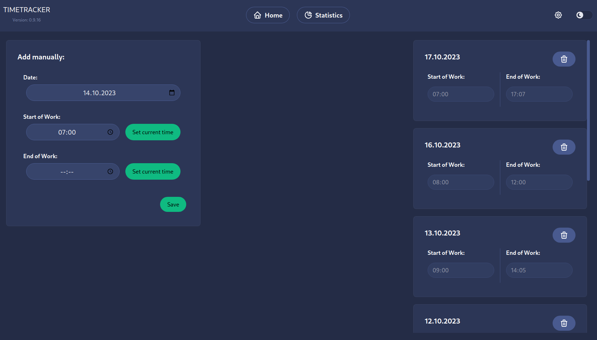
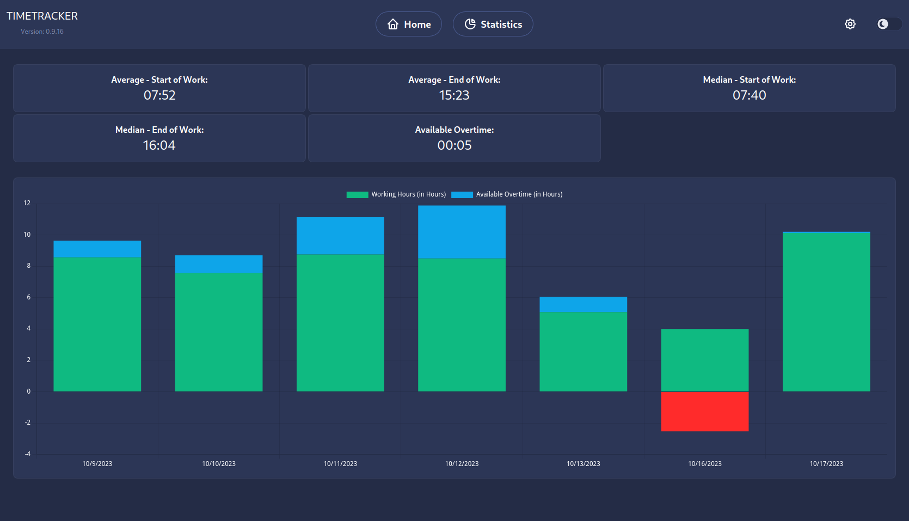
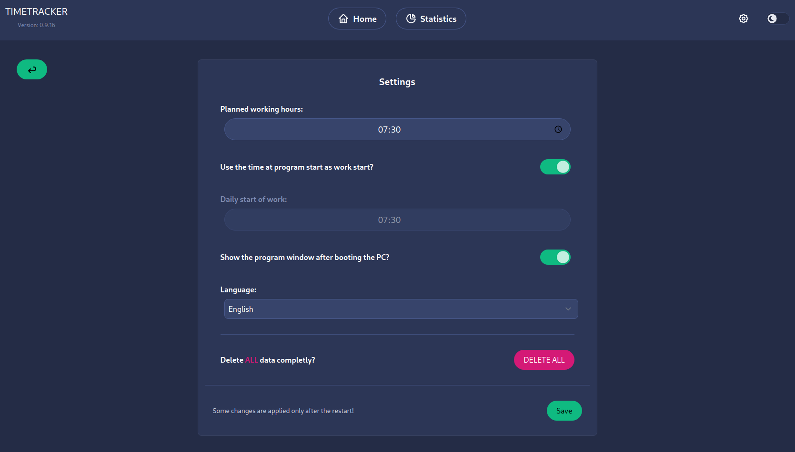

# Time Tracker

An application to track your work time ⏰

### Dashboard

<p float="left">
  
</p>

### Statistics

<p align="center">
  
</p>

### Settings

<p align="center">
  
</p>

## 🏭 Developing

👥 Clone the repository

```bash
git clone https://github.com/DerKommentator/time-tracker.git
```

🔽 Download and install the dependencies

```bash
npm ci
# or
npm install
```

💹 Start the svelte and electron application

```bash
npm run dev:electron
```

## 🧪 Testing

```bash
# Svelte Components Testing
npm run test:sveltecomp

# E2E Electron Testing
npm run test:electron
```

## 🔨 Building

```bash
# To build the electron application on linux you need to install wine32
sudo apt-get install wine32

# Building for windows and linux
npm run build
```
